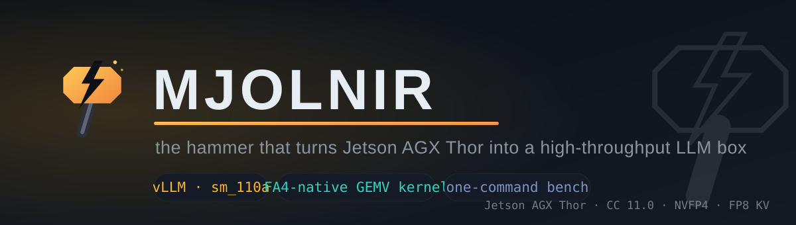
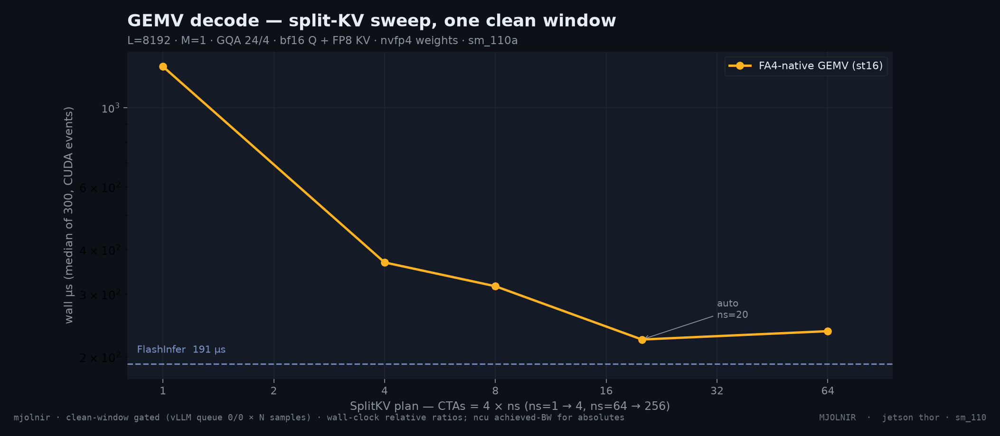
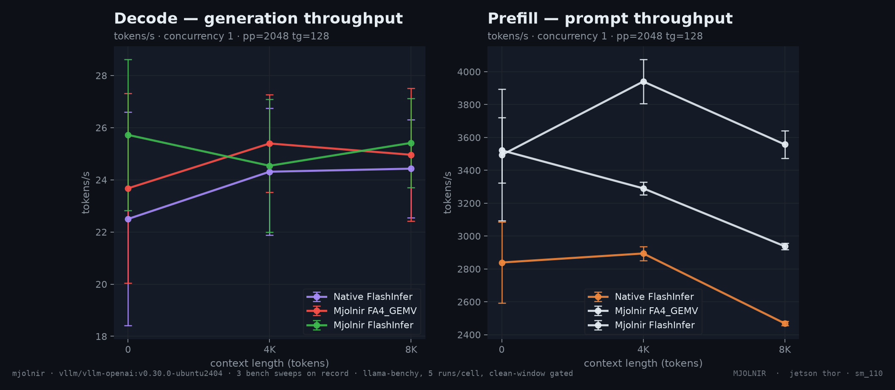
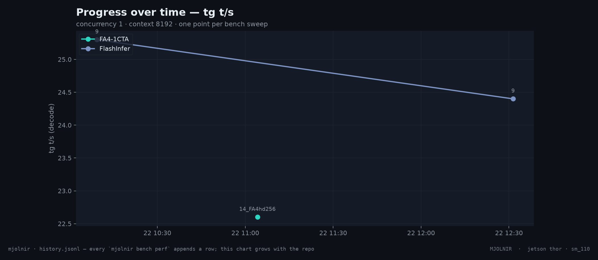

<p align="center">
  
</p>

<p align="center">
  <a href="https://github.com"></a>
  
  
  
  <a href="LICENSE"></a>
</p>

<p align="center"><em>Mjölnir</em> — the hammer that turns a Jetson AGX Thor into a high-throughput LLM box.</p>

---

**Mjolnir** is a vLLM deployment for the **NVIDIA Jetson AGX Thor** (CC 11.0,
`sm_110a`) built around three things:

1. **A patched vLLM image** — 14 hand-adapted patches on the vLLM aarch64
   nightly (FA4 hd256 enablement, the GEMV decode kernel, GDN prefill, sm_110
   gate probes, draft-decode cudagraphs) that make `Qwen3.8-27B-NVFP4`
   actually serve on Thor. Built and verified by the image itself.
2. **An FA4-native GEMV decode kernel** — a pure-FMA (no tensor-core)
   CuTe-DSL kernel for the `head_dim=256` decode shape, wired into vLLM's
   `vllm_flash_attn` cute interface. It closes the gap the tensor-core path
   left on Thor's HBM-bound decode: **within ~10% of FlashInfer**, versus
   **~2.9× slower** before.
3. **A one-command bench stack** — `mjolnir` (Python, `typer`): serve the
   model, gate every measurement on a verified idle window, run the perf
   bench (raw per-run data, no lossy wrappers), keep an append-only
   history log, and render the charts you see below.

```
mjolnir serve up          # patched vLLM + FA4 GEMV, Qwen3.8-27B NVFP4
mjolnir bench perf        # 3 gated sweeps × 5 runs/cell → raw JSON → charts
mjolnir verify            # kernel correctness suites (vs fp32 reference)
```

## Results

Kernel level — GEMV decode vs the alternatives, one clean gated window
(L=8192, M=1, GQA 24/4, bf16 Q + FP8 KV, wall µs, median of 300):

| config | wall (µs) | note |
|---|---|---|
| FA4 2-CTA tensor-core | 323 | stock FA4 hd256 path |
| FA4 1-CTA (v11 patch) | 207 | ×1.56 vs 2-CTA |
| **FA4-native GEMV, auto split-KV** | **222.8** | ← this kernel; auto picks ns=20 (80 CTAs) |
| FlashInfer FA2-tc (same window) | 202.05 | production baseline |

The two-lever decomposition (NCU achieved-BW, L2-fabric convention):
**split-KV / CTA count is the lever** — ns 1→20 = ×8.7 kernel BW
(13.5 → 118.3 GB/s vs the 273 GB/s roofline) and ×5.9 wall; ring depth
(stages 2→16) is correctness-neutral (bit-identical output) and only adds
+12.9% kernel BW at ns=20 — the right direction for large-L where KV leaves
L2. Null results (ruled out, do not re-litigate): LDGSTS-vs-LDG (both lower
to plain `LDG` on sm_110a), occupancy (96-thread CTAs, smem-bound).


*`assets/benchmarks/kernel.png` — generated by `mjolnir plot` from the
committed raw JSONs in [`benchmarks/raw/`](benchmarks/raw/).*

End-to-end throughput per backend (one row per gated bench sweep; the chart
grows with the repo — every nightly bump / kernel change appends to
[`benchmarks/history.jsonl`](benchmarks/history.jsonl)):





## Quickstart

Requirements: Jetson AGX Thor (L4T/JetPack 6.x), Docker with the NVIDIA
Container Toolkit, [uv](https://docs.astral.sh/uv/).

```bash
git clone <your>/mjolnir.git && cd mjolnir

# one-time: install the CLI (optionally from the repo checkout)
uv tool install --from git+https://github.com/<your>/mjolnir.git mjolnir
uv tool install llama-benchy            # the perf engine (raw JSON, per-run values)

# serve: Qwen3.8-27B NVFP4 + FA4 + the GEMV kernel (the baked-in defaults)
mjolnir serve up                        # builds nothing; downloads the model on first run
mjolnir serve status                     # container + /health + queue load

# the headline: 3 independent clean-window-gated sweeps, 5 measured runs
# per cell (6 cells: context 0/4K/8K × concurrency 1/2/4)
mjolnir bench perf                      # raw JSON → benchmarks/raw/…
                                         # history → benchmarks/history.jsonl
                                         # charts → assets/benchmarks/*.png
```

`mjolnir serve up` needs no `.env` — defaults are baked in
(model `Qwen/Qwen3.8-27B`, config `NVFP4_FA4hd256`, port `6001`, GEMV on).
Switch models/configs with flags or remember them with
`mjolnir model use <model> <quant>` (a 2-line state file, not an env file) —
or just `mjolnir model use` with no args for an interactive picker over
`configs/` (`mjolnir model list` shows the same table).

## How the numbers are trustworthy

The Thor GPU is shared — a desktop session and, typically, the LLM itself
run on it. Every number in this repo follows one methodology:

- **Clean-window gate** — a measurement window opens only after the vLLM
  request queue reads `0 running / 0 waiting` for N consecutive 2 s samples;
  any non-zero sample inside the window aborts the run as `DIRTY` and it is
  discarded. The vLLM server is **never** stopped or restarted to clean the
  GPU. (`mjolnir gate --once` to check the window right now.)
- **Gated relative ratios** — A/B comparisons (ns vs ns, stages vs stages,
  GEMV vs FlashInfer) are measured *inside one window*, so co-tenancy
  cancels; absolute BW statements rest on **NCU achieved-BW**, which is
  immune to ungatable desktop load.
- **Raw data, not prose** — every sweep keeps llama-benchy's raw JSON
  (per-run `values[]` → stddev) in `benchmarks/raw/`, and one normalized row
  per sweep in `benchmarks/history.jsonl`. Both are committed — the charts
  are a projection of greppable data.

## The CLI

```
serve   up | down | status | logs     drive the vLLM container (patched image)
model   use <model> <quant> | show    remember the active model/config
image   build | gates                 build the patched image / run the canaries
vfa     prepare                       build the GEMV'd vllm_flash_attn tree
gate    [--once] [--confirm N]       the clean-window gate
bench   perf | ab | kernel <task>    e2e perf · FA4-vs-FI A/B · kernel benches
verify  [gemv-verify …]              kernel correctness suites (vs fp32 ref)
plot    [--concurrency c] [--context L]   render the README charts
history [--limit N]                  the append-only bench log
```

```bash
mjolnir bench ab --backends fa4-gemv,flashinfer
# restarts the server per leg, gated perf for each, one history row-set per leg

mjolnir bench kernel gemv-ringfix --out /p/r.json   # the ns sweep + FI, one window
mjolnir bench kernel gemv-bench --mode gemv_paged   # 4-mode kernel bench
mjolnir verify                                     # all GEMV correctness suites
```

## Repository layout

```
├── src/mjolnir/            the CLI + package (typer; serve/bench/gate/plots)
├── docker/vllm-thor/       the build: Dockerfile + patches/ + apply/verify
│   ├── fa4-gemv-kernel/    the GEMV kernel package (kernel + dispatch diff + bench/verify)
│   └── PATCHES.md          the per-patch inventory
├── configs/Qwen/           model configs (the default NVFP4_FA4hd256 + FI baseline)
├── benchmarks/
│   ├── raw/                committed raw JSONs (kernel benches; perf raws land here)
│   └── history.jsonl       append-only e2e bench history
├── assets/                 logo / hero / arch SVGs + generated benchmark charts
└── docs/fa4-hd256-fp8/     the workstream reports (design, methodology, results)
```

## Going deeper

- The GEMV kernel — design, dispatch, methodology:
  [`docker/vllm-thor/fa4-gemv-kernel/README.md`](docker/vllm-thor/fa4-gemv-kernel/README.md)
- The patch stack (14 patches, per-patch analysis):
  [`docker/vllm-thor/PATCHES.md`](docker/vllm-thor/PATCHES.md)
- Workstream reports (kernel design, ncu gap analysis, 1CTA, split-KV):
  [`docs/fa4-hd256-fp8/`](docs/fa4-hd256-fp8/)

## Roadmap

- [ ] B3: mma.sync tile-shape GEMV for exact FlashInfer parity (closing the
      last ~10%)
- [ ] varlen-M GEMV (decode with MTP verify, M ≤ 8)
- [ ] upstream: FA4 hd256 FP8-descale (tracked at Dao-AILab/flash-attention#2456)
- [ ] CI: image build + `functional` canary on aarch64 runners

## License

Apache-2.0 — see [LICENSE](LICENSE).

<p align="center"><sub>⚡ Mjolnir — "the one that gets hot when the thunder roars."</sub></p>
